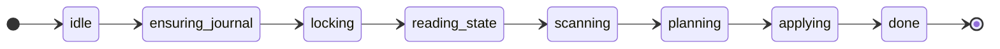

# Migraterl

[](https://builtwithnix.org)
[![[Nix] Build](https://github.com/dont-rely-on-nulls/migraterl/actions/workflows/ci.yml/badge.svg)](https://github.com/dont-rely-on-nulls/migraterl/actions/workflows/ci.yml)


A forward-only SQL migration engine for **PostgreSQL**, built on `gen_statem` and a temporal tables, hash-based journal.

## Status

> [!NOTE]
> This is still experimental, expect heavy API chages before 1.0.0.

### Requirements

- **PostgreSQL 18+**: the journal relies on application-time temporal support (`WITHOUT OVERLAPS` primary keys and `UPDATE ... FOR PORTION OF`). The trusted `btree_gist` extension is created automatically on first run.

### How it works

A run is modelled as a `gen_statem` that walks a linear lifecycle:



- **Namespaces** group scripts that are journaled independently.
- Each script is classified by the source it comes from:
  - `once`: applied a single time, keyed by name.
  - `on_change`: re-applied whenever its content hash changes.
  - `always`: applied on every run, never journaled.
- A **pure diff engine** compares the on-disk SHA-256 hashes against the journal and applies only what is needed, detecting content drift and out-of-order insertions.
- Every run takes a **session advisory lock** on the namespace, so concurrent deploys serialize safely.
- Applied scripts are recorded in a **temporal journal**, re-applying an `on_change` script closes the previous validity period and opens a new one, preserving a full audit trail with no triggers.

### Usage

```erlang
Conn = migraterl:default_connection(),

{ok, Summary} = migraterl:migrate(Conn, #{
    namespace => <<"app">>,
    sources => [
        {once,      "priv/migrations/schema"},
        {on_change, "priv/migrations/views"},
        {always,    "priv/migrations/grants"}
    ],
    txn => per_script,                 % per_script | single | none
    on_out_of_order => warn,           % warn | error | ignore
    variables => #{<<"env">> => <<"prod">>}
}),
%% Summary :: #{planned := [...], applied := [...], skipped := [...], warnings := [...]}

%% Dry run, compute the plan without applying:
{ok, Plan} = migraterl:plan(Conn, Opts),

%% Inspect the currently-applied state:
{ok, State} = migraterl:status(Conn, <<"app">>).
```

Variables written as `$name$` in a script are substituted at execution time.

### Reactive extras (opt-in)

- `migraterl_listener`: holds a dedicated connection that `LISTEN`s on `migraterl_events` and forwards `pg_notify` hints (emitted on each apply) to subscribed processes.
- `migraterl_watcher`: a supervised `gen_statem` that uses the optional [`fs`](https://github.com/synrc/fs) application to watch source directories and re-run (debounced) on `.sql` changes; handy for "apply on save" during local development.

Configure watchers in the application environment and `migraterl_sup` keeps one alive per entry, so the app auto-migrates on change without any glue code:

```erlang
{migraterl, [
    {watchers, [
        #{conn => #{host => "127.0.0.1", username => "app",
                    password => "app", database => "app"},
          debounce_ms => 300,
          migrate => #{namespace => <<"app">>,
                       sources => [{once, "priv/migrations/schema"}]}}
    ]}
]}.
```

With no `watchers` configured the supervisor runs empty and each `migraterl:migrate/2` call spawns its own transient runner.

## Development

We have [devenv](https://devenv.sh/) setup and everything is based on [Nix](https://nixos.org/), you can check our [flake.nix](https://github.com/dont-rely-on-nulls/migraterl/blob/master/flake.nix) to learn how it looks like.

```shell
nix develop --impure
# to spawn a postgres database
devenv up
```
there's also a [justfile](https://github.com/casey/just) to manage builds and tests.
```shell
# will show all commands supported
just
```

### Testing

```shell
# You can either run rebar directly
rebar3 ct
# or
just t
```

## Inspiration

- [DbUp](https://dbup.readthedocs.io/en/latest/)
